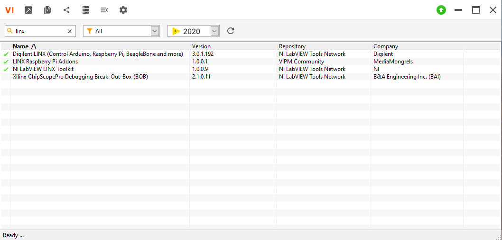
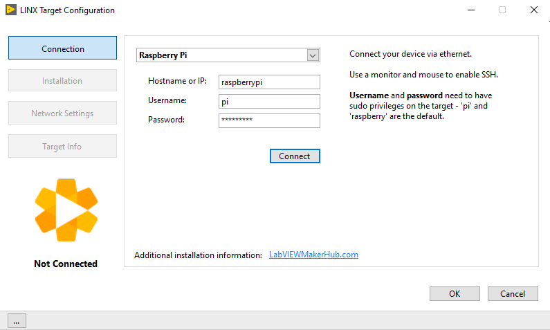
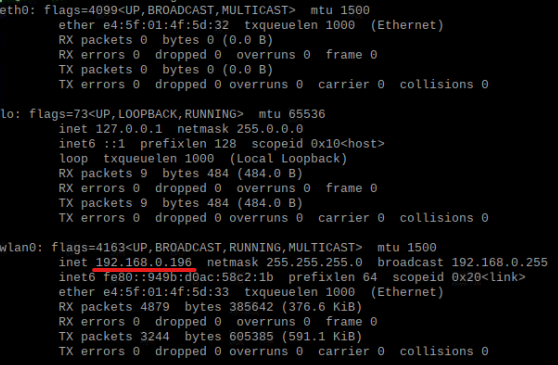
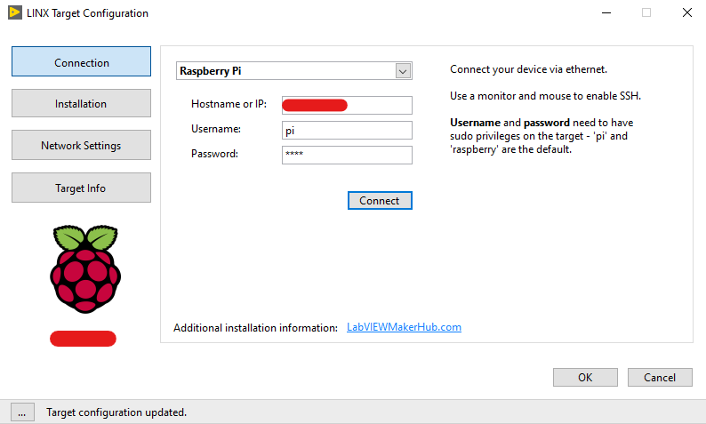
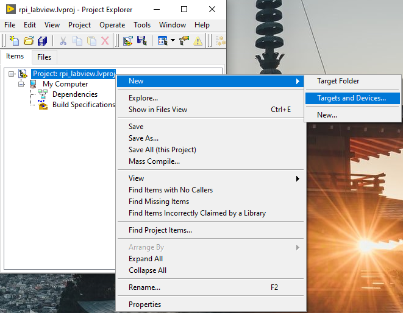
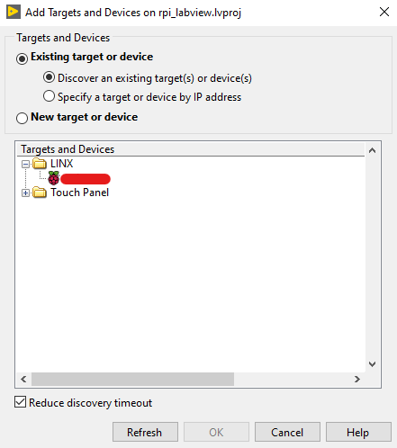

# Table of Content

- [Links](#links)
- [Install Labview](#install-labview)
- [Install Libraries](#install-libraries)
- [Create Project](#create-project)
- [Components](#components)
- [Set Static IP Address](#static-ip)

# Links

# Install Labview

- Version : 2020 (20.0f1 32-bit)

1. Extract everything from the archive  **NI LabView 2020 v20.0.1 (x86).rar**.

2. Double-click on **Install.exe**.

3. Follow the instructions shown in order to complete the installation.

4. After installing LabVIEW go to **Crack** folder.

5. Double click on **NI License Activator 1.2.exe**.

6. It will show all versions of LabVIEW that you have on your computer.

7. Right-click on each square and click **activate**.

8. All the squares should be green in order to fully activate LabVIEW.

# Install Libraries

1. Open **VI Package Manager (VIPM)**.

2. Select version 2020 from the dropdown on the top of the window.

3. Search for **LINX**

4. You should see something like this



5. You need to install 

```
Digilent LINX (Control Arduino, Raspberry Pi, BeagleBone and more)
LINX Raspberry Pi Addons
NI LabVIEW LINK Toolkit
```

6. Right-Click on each of these libraries and click install.

7. After instlling everything you should see a check mark on the left side

# Create Project

1. Open LabVIEW 2020.

2. **File** > **Create Project** > **Blank Project**.

3. **Tools** > **MakerHub** > **LINX** > **LINX Target Configuration**.



4. Go to Raspberry PI board and open a terminal and enter the following command to get the IP address : 

```
ifconfig
```



5. In the **Hostname or IP** enter the RPi IP.

6. Enter the username and password of your board.

7. After clicking **Connect** you should see that everything is ok : 



8. Go to **Installtion** tab and press **Upgrade** to install everything on your board.

9. After installing everything press **Ok**.

10. Right click on the project > **New** > **Targets and Devices**.



11. Select the board and click **OK**:



12. The board should be added to your project and from now on you can create VIs to work on it.

13. You can find examples from **Help** > **Find Examples** > **Search** > Type **LINX**
# Components


## Raspberry Pi 4 (4Gb)


Raspbian OS version used: `	Raspberry OS - 2021-05-07-raspios-buster`

Overclock RPi: 

```

```

# Static IP

1. Get the IPV4 address

```
hostname -I
```

2. Get router IP address

```
ip r
```

3. Get the IP address of your DNS

```
grep "namesever" /etc/resolv.conf
```

4. Open dhcpcd.conf file

```
sudo nano /etc/dhcpcd.conf
```

5. Add the following lines at the end of the file

```
interface [INTERFACE]
static_routers=[ROUTER IP]
static domain_name_servers=[DNS IP]
inform ip_address=[STATIC IP ADDRESS YOU WANT]/24
```

6. Press **CTRL + X**, then **Y** and finally **ENTER**

7. **Reboot** the board